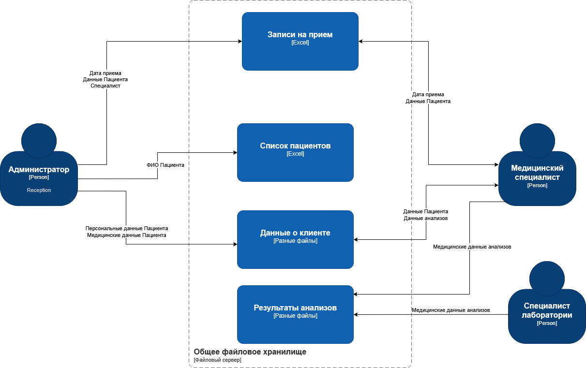
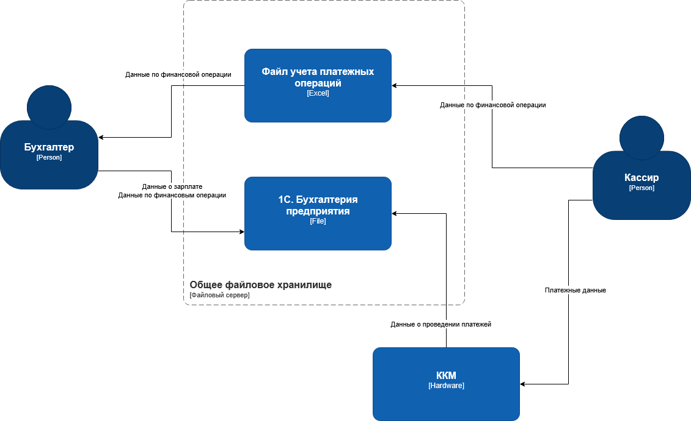
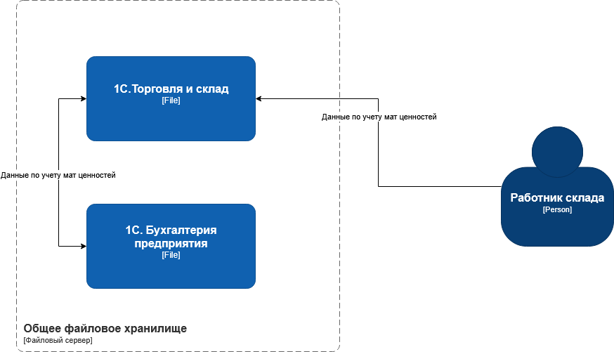
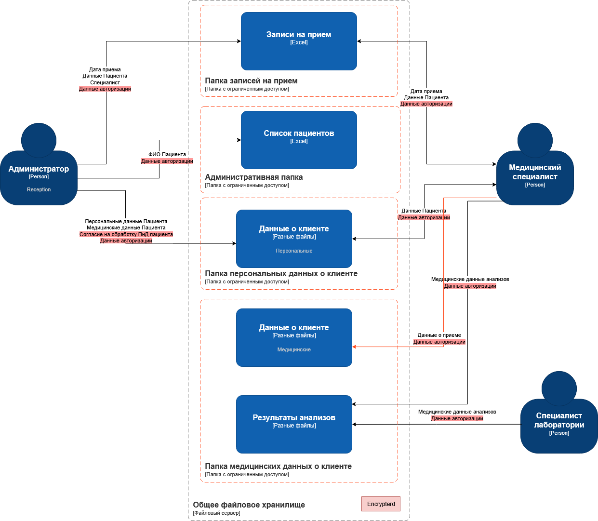
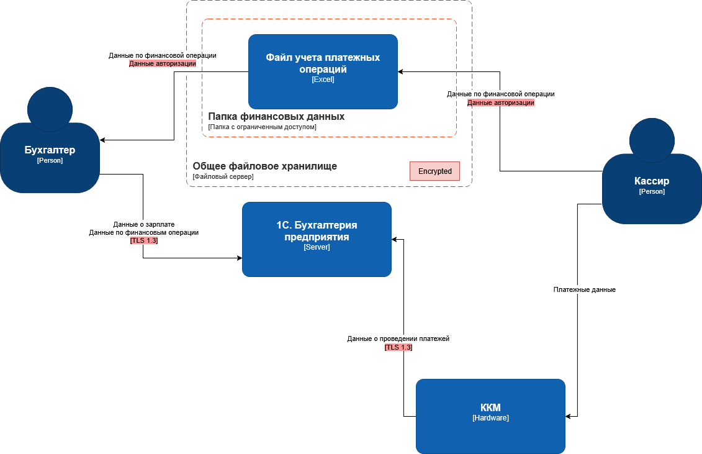
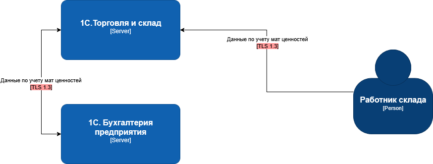

##Задание 1.

###Текущие диаграммы потоков данных
Можно выделить три составляющие компании

1. Запись и прием пациента
   
   
   
2. Учет денежных стредств
   
   
   
3. Учет материальных ценностей
   
   

###Аудит обеспечения мер безопасности при работе с данными
| **Безопасность данных**                                                                                                                     |      |   |
| 1 | Разработана ли политика классификации данных, и актуализируется ли она в соответствии с действующим законодательством?                  | Нет  | Классификация отсутствует. Хранение не соответствует законодательству|
| 2 | Используется ли шифрование на уровне базы данных, файловой системы и при передаче данных по сети?                                       | Нет  | Нешифрованное файловое хранилище |
| 3 | Реализованы ли механизмы управления ключами шифрования?                                                                                 | Нет  |              |
| 4 | Проводится ли регулярное резервное копирование данных? Хранятся ли резервные копии в защищённых хранилищах?                             | Нет  | Нет данных о наличии резервного копирования |
| 5 | Выполняется ли регулярное тестирование процесса восстановления данных из резервных копий?                                               | Нет  | Нет данных о наличии резервного копирования |
| 6 | Ограничен ли доступ к резервным копиям данных, и зашифрованы ли они?                                                                    | Нет  | Нет данных о наличии резервного копирования |
| 7 | Ведётся ли учёт персональных данных, и применяются ли специальные процедуры обработки и хранения для различных типов данных?            | Нет  |   |
| 8 | Осуществляется ли мониторинг доступа к данным на основе их классификации? Используются ли метки безопасности для маркировки данных?     | Нет  |   |
| 9 | Разработаны ли процессы и системы Data Governance для управления данными?                                                               | Нет  |   |
| 10| Реализованы ли системы или процессы безопасного уничтожения данных?                                                                     | Нет  |   |
| 11| Используются ли системы или процессы контроля целостности данных?                                                                       | Нет  |   |
| 12| Реализованы ли системы или процессы контроля сохранности данных?                                                                        | Нет  |   |
| 13| Применяются ли средства или процессы анонимизации данных?                                                                               | Нет  |   |
| 14| Разработана ли инструкция по процессу восстановления данных?                                                                            | Нет  |   |

Описание проблемных зон на основе анализа текущей архитектуры представлено в файле [problems.md](problems.md)

###Что можно улучшить

В системе присутствуют следующие категории чувствительных данных

|**Категория**|**Состав**|**Предлагаемый метод защиты**|
|---|---|---|
|PII| ФИО, контакты|Обфускация, токенизация|
|PHI| Хронические заболевания, диагнозы, результаты анализов|Обезличивание, шифрование|
|PFI| Платежные данные, ТМЦ|Шифрование|

Предлагаются следующие улучшения по защите данных:

- Добавить подписание согласия на сбор хранение и обработку ПнД при регистрации новых пациентов в системе
- Настроить шифрование дисков, на которых хранятся Excel-файлы
- Перевести 1С системы с файлового режима на клиент-серверную архитектуру, с работой по защищенному протоколу TLS версией 1.2 и выше
- Перевести взаимодействие ККМ с 1С.Бухгалтерия через протокол TLS версии 1.2 и выше
- Настроить разграничение доступа к файлам и директориям на базе ролевой модели Active Directory
- Рассмотреть возможности автоматизации ручных процессов
- Организовать резервное копирование данных
- Необходимо внедрить тегирование данных на базе Apache Atlas
- Организация логирования и мониторинга сильно усложнена низким уровнем автоматизации. Имеет смысл заниматься этим совместно с активностью по автоматизации.

Таким образом обновленные диаграммы потоков данных будут выглядеть следующим образом

1. Запись и прием пациента

   

2. Учет денежных стредств

   

3. Учет материальных ценностей

   