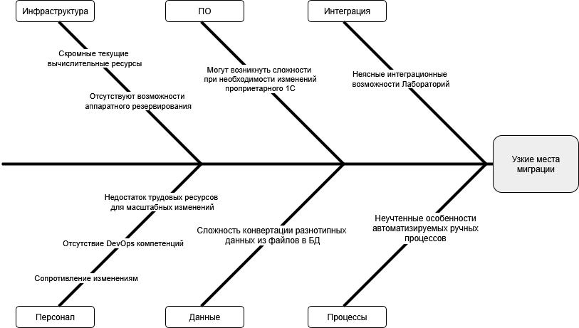

##Описание планируемой миграции

В рамках планируемого миграции можно выделить ряд изменений:
- внедрение портала клиента (ранее по по телефону или при личном присутствии)
- внедрение портала сотрудника ресепшен (ранее ручной ввод в файлы)
- внедрение CRM со своей БД и автоматизацией обработки (ранее просто файлы на общем диске)
- внедрение системы логирования, аудита и мониторинга (ранее не было)
- реализация резервирования (отсутствовало)
- перевод 1С на клиент-серверный режим (ранее файловый)
- перевод взаимодействия с лабораторией на API вызовы (ранее прямая передача файлов)
- внедрение сервиса аутентификации и авторизации (ранее доменная аутентификация Active Directory)
- внедрение сервиса BI аналитики

##Оценка узких мест миграции
Диаграмма "Рыбья кость"
    

##Проблемы и рекомендации
Перечислим обнаруженные риски и рекомендации к их минимизации

* ###Инфраструктура
    - Скромные текущие вычислительные ресурсы (одинокий сервер для всей системы, расположенный в офисе)
        - имеет смысл рассмотреть перенос системы в облако (Yandex.Cloud) либо спроектировать расширение аппаратной составляющей системы
    - Отсутствуют возможности аппаратного резервирования (один сервер, нет "горячего" или "холодного" резервирования)
        - имеет смысл рассмотреть перенос системы в облако (Yandex.Cloud) либо спроектировать расширение аппаратной составляющей системы
* ###Программное обеспечение
    - Могут возникнуть сложности при необходимости изменений проприетарного 1С
        - Рассмотреть возможность перехода на собственные микросервисы либо изучить альтернативные готовые решения. 
* ###Интеграция
    - Неясные интеграционные возможности лабораторий
        - Следует на ранних этапах предупредить уже подключенные лаборатории о внедряемом API, сроках, предоставить контракты взаимодействия.
* ###Персонал
    - Недостаток трудовых ресурсов для масштабных изменений (три сотрудника IT)
        - Возможен найм дополнительных специалистов под проект, либо обращение к аутсорсинговой IT компании
    - Отсутствие DevOps компетенций
        - Полноценное обучение действующего сотрудника, либо найм профильного специалиста
    - Сопротивление изменениям (со стороны внутренних пользователей)
        - Провести обучение персонала. Организовать встречи с описанием причин появления нововведений, новых возможностей и популяризация обновленной системы
* ###Данные
    - Сложность конвертации разнотипных данных из файлов в БД
        - Подобрать инструменты ETL, например Apache NiFi
* ###Процессы
    - Неучтенные особенности автоматизируемых ручных процессов
        - Поэтапная замена ручных процессов с канареечными релизами при параллельном сохранении работы прежнего подхода.